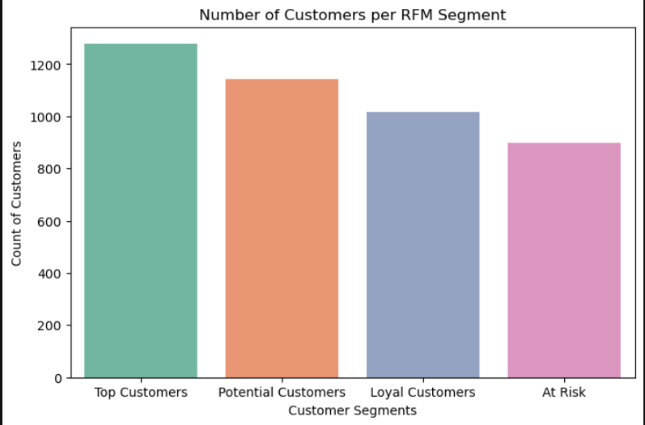

# 🛍️ Customer Segmentation Using RFM Analysis

This project analyzes customer behavior using **RFM (Recency, Frequency, Monetary) Analysis** on a retail sales dataset.  
RFM helps businesses understand how recently customers purchased, how often they buy, and how much they spend — enabling smarter marketing decisions.

---

## 📌 Project Workflow

1. **Data Cleaning**
   - Removed missing `CustomerID` and canceled/negative invoices  
   - Created a new column: `TotalPrice = Quantity × UnitPrice`

2. **RFM Calculation**
   - **Recency** → Days since last purchase  
   - **Frequency** → Number of purchases  
   - **Monetary** → Total amount spent  

3. **RFM Scoring & Segmentation**
   - Scored each metric (1–5)  
   - Combined into an **RFM Score**  
   - Grouped customers into:
     - 🏆 **Top Customers**  
     - 💎 **Loyal Customers**  
     - 🌱 **Potential Customers**  
     - ⚠️ **At Risk**  

4. **Visualization**
   - Bar charts → customer distribution by segment  
   - Heatmaps → average RFM metrics per segment  

---

## 📊 Key Insights

- **Top Customers** → High spenders, purchase often → Reward with VIP perks.  
- **Loyal Customers** → Buy frequently, steady spend → Engage with loyalty points & recommendations.  
- **Potential Customers** → Moderate engagement → Motivate with limited-time deals.  
- **At Risk** → Haven’t bought recently → Re-engage with win-back campaigns.  


## 📊 Visualizations  

### 📈 Customer Distribution by Segment 
 
  

### 🔥 Average RFM Metrics by Segment 
 
  

## 🛠️ Tools & Libraries

- Python (Pandas, Numpy)  
- Matplotlib, Seaborn (Data Visualization)  
- Jupyter Notebook  

---

## 📂 Repository Structure

### 📦 Customer-RFM-Analysis
┣ 📂 pics/ 
┃ ┣ 📜 screenshot_1.png 
┃ ┗ 📜 screenshot_2.png 
┣ 📜 RFM_Analysis.ipynb
┣ 📜 Online Retail.csv 
┣ 📜 requirements.txt 
┗ 📜 README.md 


---

## 🚀 Future Improvements

- Apply **KMeans clustering** for advanced customer segmentation  
- Build an **interactive dashboard (Power BI / Tableau)**  
- Automate RFM scoring with a pipeline for real-time analysis  

---

## ⚡ How to Run

1. Clone the repository  
   ```bash
   git clone https://github.com/yourusername/Customer-RFM-Analysis.git
   cd Customer-RFM-Analysis

2. Install dependencies
   pip install -r requirements.txt

3. Open Jupyter Notebook and run
   jupyter notebook RFM_Analysis.ipynb


---
## 📬 Author  
**Ashar Aftab**  
📧 Email: [asharaftab2004@gmail.com](mailto:asharaftab2004@gmail.com)  
🔗 LinkedIn: www.linkedin.com/in/ashar-aftab-b09924295

---

## 📜 License  
This project is free for educational and non-commercial use.  
Feel free to fork, improve, and give credit where due.

---

## 🗂️ Dataset Source

Click Here to Get Dataset: https://drive.google.com/file/d/1XFs6_s2aLi88dAJr7sPC4B5gEECsdB7H/view?usp=drive_link

---

> If you found this project useful or insightful, consider giving it a ⭐ on GitHub!


